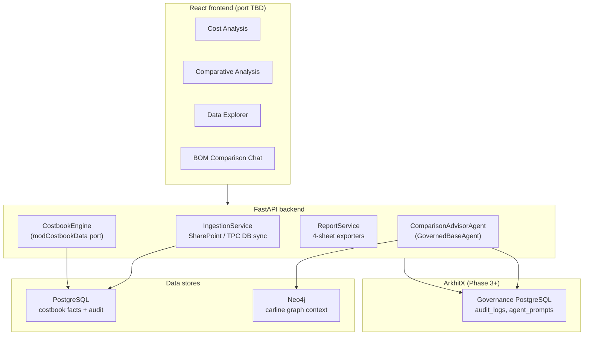

# ArkhitX Rebuild Plan — TPC Synthesis Generator

How to replace the Excel/VBA **CostBooks Synthesis Generator** with a governed AI application under ArkhitX — aligned with the *Costed BOM Comparison Agentic AI Chatbot* initiative.

## Strategy: build first, govern after

Per ArkhitX methodology:

1. **Phase 0** — Build a working web app that reproduces core TPC analysis (no ArkhitX dependency)
2. **Phase 1** — Extract ontology from working code
3. **Phase 2** — Seed Neo4j with carlines, costbooks, part lines
4. **Phase 3** — Wire `GovernedBaseAgent` for NL Q&A and narrative gap explanations
5. **Phases 4–5** — Validate grounding scores and ship

**Critical split:** Deterministic cost math stays in **Python services** (parity with `modCostbookData`). LLM agents explain, summarize, and answer questions — they do not invent TPC numbers.

## What moves out of Excel

| Excel component | ArkhitX replacement |
|-----------------|---------------------|
| Power Query refresh | Backend ingestion service (SharePoint / DB API) |
| Hidden sheets as tables | PostgreSQL (operational) + optional Neo4j (graph queries) |
| `modCostbookData` | `services/costbook_engine.py` — port functions 1:1 |
| `frmCostbooks` UI | React app (`projects/bom/frontend/`) with ArkhitX design system |
| GDI+ charts | Recharts / D3 (web-native) |
| `modCostbookReport` | Report service: Excel export (openpyxl) + PDF (optional) |
| Manual filter navigation | Structured UI filters **plus** agentic chat |
| Nothing | Audit log of every comparison and export |
| Nothing | Grounding-scored answers citing graph entities |

## Target architecture



## Phase 0 — Standalone MVP (scaffold first)

```bash
python scripts/new_project.py bom --name "Costed BOM Comparison"
```

### Backend services (deterministic — no LLM)

Port `modCostbookData` into typed Python modules:

| Python module | VBA source | Priority |
|---------------|------------|----------|
| `costbook_index.py` | `LoadCostbookIndex`, `CostbookIndex` | P0 |
| `costbook_rows.py` | `GetCostbookRows`, `TotalTPC` | P0 |
| `filters.py` | `FilteredCostbooks`, `DistinctAttr`, multi-select OR | P0 |
| `aggregation.py` | `ParetoAgg`, `TopN`, `FilterRowsBy` | P0 |
| `gap_analysis.py` | `GapAgg`, `GapReportAgg`, `AlignedBomGap`, `ComposeGapReport` | P0 |
| `currency.py` | `CostbookConversionFactor`, `RateFor` | P1 |
| `explorer.py` | `ExplorerData`, `SourceFileFor` | P1 |
| `report_costbook.py` | `ExtractFullReport` | P1 |
| `report_gap.py` | `ExtractGapReport` | P1 |

**Test strategy:** Golden-file tests — run Excel export on fixture costbooks, run Python engine on same inputs, diff numeric outputs to 4 decimal places.

### Frontend — Comparison Workspace (not three Excel tabs)

See **[UX-WORKFLOW.md](./UX-WORKFLOW.md)** for the full shell layout, user journeys, routes, and component map.

Summary: one `WorkspacePage` with carline rail + milestone timeline + comparison strip (up to 5 costbooks) + linked detail tabs. Catalog explorer is a drawer, not a separate page.

Use `framework/design-system/` tokens (`ax-panel`, `ax-btn-primary`, dark/light toggle).

### Data ingestion (Phase 0 minimum)

Start with **local fixtures** (no mock intelligence — real rows from the Excel snapshot):

1. Export `StackedCostbooks`, `CarlinesDefinition`, `CostBookRecords`, `ExchangeRates` to CSV/Parquet from the `.xlsm`
2. Load into PostgreSQL via Alembic migration + seed script
3. Later: replace with SharePoint Graph API or TPC Database REST endpoint

The workbook already proves the schema — do not redesign speculatively.

## Phase 1 — Ontology (extract from code)

Register project and emit `ontology/bom_ontology.json`:

### Entity types

| Entity | Key properties | Source |
|--------|----------------|--------|
| `Carline` | title, project, program, region, platform, powertrain_type, base_currency, sop_date, … | CarlinesDefinition row |
| `Costbook` | vehicle_code, milestone, milestone_date, total_tpc, source_url | Index key |
| `PartLine` | part_number, part_description, tpc, qty, vsc, macro_system, fifth, l1, l2, l3, … | StackedCostbooks row |
| `Milestone` | code, lifecycle_order | Config table |
| `ExchangeRate` | currency, year, rate | ExchangeRates |
| `ComparisonSession` | baseline_id, compare_ids[], display_currency, created_by | New — app-generated |

### Relationship types

```text
(Carline)-[:HAS_COSTBOOK]->(Costbook)
(Costbook)-[:CONTAINS_PART]->(PartLine)
(Costbook)-[:DERIVED_FROM]->(SourceFile)
(Costbook)-[:AT_MILESTONE]->(Milestone)
(ComparisonSession)-[:BASELINE]->(Costbook)
(ComparisonSession)-[:COMPARES]->(Costbook)
(PartLine)-[:ROLLS_UP_TO]->(SystemNode)   # optional Phase 2
```

Run: `python scripts/01_register_project.py`

## Phase 2 — Knowledge graph

Seed Neo4j from PostgreSQL:

- **Carline** nodes with filter attributes (for agent grounding queries)
- **Costbook** nodes linked to carlines
- **PartLine** nodes (or aggregate **SystemNode** for L1/L2/L3 to keep graph size manageable)
- **Comparison** patterns: `(Costbook)-[:GAP_WITH {amount, pct}]->(Costbook)` precomputed for common pairs (optional optimization)

Agents should query: *"What are the top gap drivers between CM and PM for vehicle X?"* → traverse PartLine → System hierarchy.

Run: `python scripts/02_seed_graph.py`

## Phase 3 — Governed AI layer

### Agents (extend `GovernedBaseAgent`)

| Agent ID | Role | Grounding query |
|----------|------|-----------------|
| `bom-comparison-advisor` | NL Q&A over comparisons, explains gaps in business language | `{entity_type: "Costbook", depth: 2}` |
| `bom-report-narrator` | Generates executive summary paragraphs for exported reports | `{entity_type: "ComparisonSession", depth: 1}` |
| `bom-explorer-guide` | Helps users find the right costbook via conversational filters | `{entity_type: "Carline", depth: 1}` |

**Rules:**

- Agent calls `CostbookEngine` for all numbers — never hallucinate TPC
- Prompts in `agent_prompts` table; local fallback in `_default_system_prompt()`
- Every LLM call → `audit_logs` + grounding score

### Example agent flow

```text
User: "Why did chassis cost increase between IM and CM on the JT Big Horn?"

1. ComparisonAdvisorAgent parses intent → identifies two Costbook nodes
2. CostbookEngine.AlignedBomGap(baseline, compare) → deterministic gap rows
3. Agent receives top 20 gap rows as context (grounding payload)
4. LLM narrates drivers citing part numbers and systems from payload
5. Audit log stores query, context, response, grounding score
```

### Chat UI

Add **BOM Comparison Chat** panel to Comparative Analysis page — same session as structured filters. Chat actions can set filter state (tool calls → API endpoints, not free-text SQL).

## What AI should NOT replace

Keep deterministic (Python, tested):

- Pareto math and cumulative percentages
- Currency conversion factors
- BOM line alignment algorithm
- Gap sort order (two-sided Pareto)
- Report sheet layouts and numeric columns

LLM adds value for:

- Natural language costbook discovery
- Explaining *why* a gap matters to program stakeholders
- Summarizing multi-costbook comparisons for gate decks
- Translating VSC/PORO jargon for non-specialists

## Migration path from Excel

| Step | Action |
|------|--------|
| 1 | Export current PQ tables to seed PostgreSQL |
| 2 | Implement `CostbookEngine` with parity tests against Excel exports |
| 3 | Ship web UI to pilot users (Phase 0) |
| 4 | Run both tools in parallel until numeric parity signed off |
| 5 | Register ontology, seed graph, enable chat agent (Phases 1–3) |
| 6 | Retire Excel tool for new comparisons; keep read-only archive |

## Suggested project layout

```text
projects/bom/
├── docs/                          ← this folder
├── backend/
│   └── app/
│       ├── services/
│       │   ├── costbook_engine.py   # modCostbookData port
│       │   ├── ingestion.py
│       │   └── report_service.py
│       ├── agents/
│       │   └── comparison_advisor_agent.py
│       └── api/
│           ├── costbooks.py
│           ├── comparisons.py
│           └── reports.py
├── frontend/
│   └── src/pages/
│       ├── CostAnalysisPage.tsx
│       ├── ComparativeAnalysisPage.tsx
│       ├── DataExplorerPage.tsx
│       └── ChatPanel.tsx
├── ontology/
│   └── bom_ontology.json
├── scripts/
│   ├── 01_register_project.py
│   ├── 02_seed_graph.py
│   └── export_excel_tables.py     # one-time PQ → CSV
└── samples/
    └── CC21_BEV_300_L2_Luc.xlsx   # copy from Tools/
```

## Effort estimate (rough)

| Workstream | Scope | Notes |
|------------|-------|-------|
| CostbookEngine port | 2–3 weeks | Largest piece; test-driven against Excel |
| Frontend (3 pages) | 2 weeks | Design system already available |
| Ingestion pipeline | 1–2 weeks | Depends on SharePoint API access |
| Report export | 1 week | openpyxl reproduces 8 sheet templates |
| Ontology + graph seed | 3–5 days | After engine stable |
| Comparison advisor agent | 1 week | After graph populated |
| Parity validation | 1 week | Side-by-side with Excel |

## Immediate next steps

1. **Export tables** from the `.xlsm` to `samples/` (StackedCostbooks is large — use Parquet)
2. **Scaffold** `projects/bom` via `new_project.py` when ready to code
3. **Write parity tests** starting with `ParetoAgg`, `GapAgg`, `AlignedBomGap` on a 100-row fixture
4. **Copy** `CC21 BEV 300 L2_Luc.xlsx` to samples as a known single-costbook reference
5. **Link** this project to Stell AI Arch Gate as the delivery vehicle for Gate 1 PoC evidence

## Related documentation

- [UX-WORKFLOW.md](./UX-WORKFLOW.md) — proposed web UX (Comparison Workspace)
- [TPC-SYNTHESIS-GENERATOR-OVERVIEW.md](./TPC-SYNTHESIS-GENERATOR-OVERVIEW.md) — business capabilities
- [TPC-SYNTHESIS-GENERATOR-TECHNICAL.md](./TPC-SYNTHESIS-GENERATOR-TECHNICAL.md) — VBA/module reference for porting
- `../stell-ai-arch-gate/` — gate tracking for the Costed BOM Comparison POC
- `METHODOLOGY.md` (workspace root) — ArkhitX phase definitions
