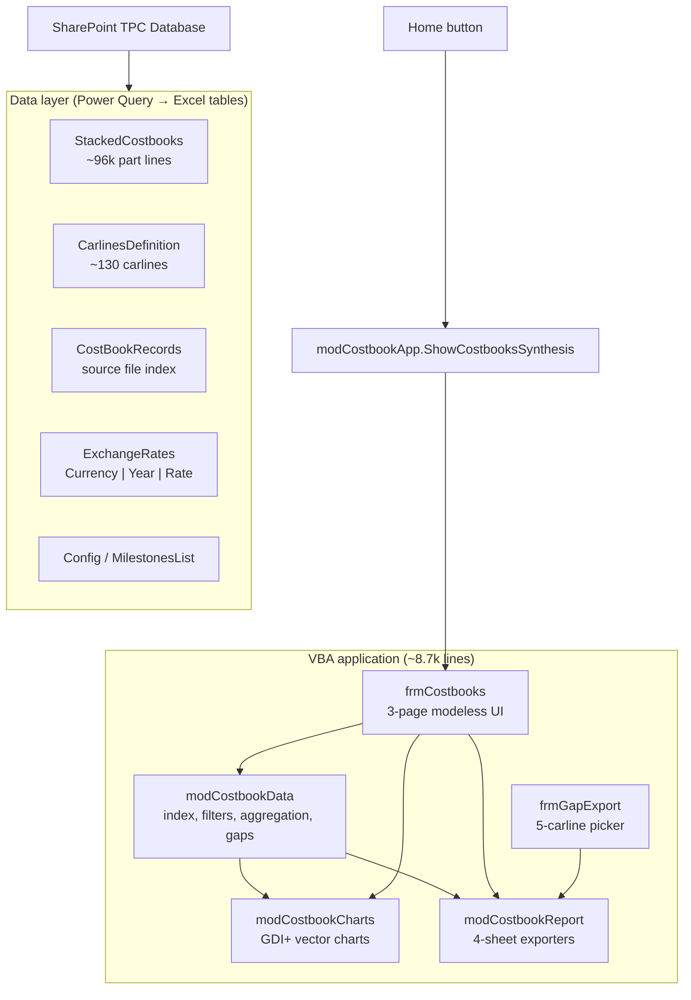
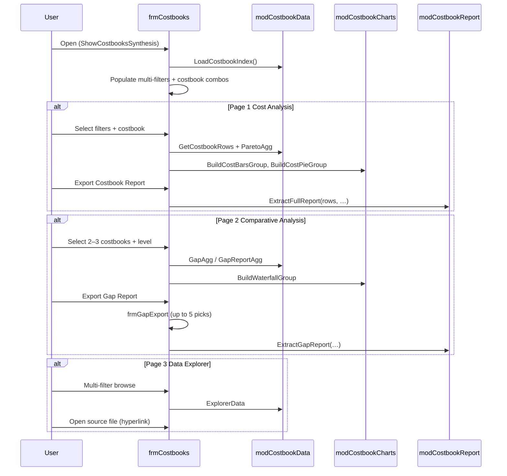

# TPC Synthesis Generator — Technical Reference

Reverse-engineered from `TPC Database - Synthesis Generator.xlsm`. VBA source is in `_extracted_vba/`.

## Architecture (Excel)



## Workbook structure

| Sheet | Visibility | Role |
|-------|------------|------|
| `Home` | Visible | Launch button; sheet-protected |
| `ExchangeRates` | Hidden | Power Query → table `ExchangeRates` |
| `CarlinesDefinition` | Hidden | Power Query → table `CarlinesDefinition` |
| `StackedCostbooks` | Hidden | Power Query → table `StackedCostbooks` (main fact table) |
| `Config` | Hidden | Milestone lifecycle order (`MilestonesList`) |
| `CostBookRecords` | Hidden | Power Query → table `CostBookRecords` |
| `TPC_ChartScratch` | Very hidden | Temporary GDI+ chart shapes |

All four data connections use **Power Query (Mashup OLE DB)** — `SELECT * FROM [TableName]` — loading from the embedded TPC Database model, originally synced from SharePoint (`shiftup.sharepoint.com/.../CTPC/TPC Database/`).

## Core data model

### Costbook identity

A costbook is uniquely identified by:

```
(Vehicle Code, Milestone, Milestone Date)
```

Stable date key: `yyyy-mm-dd` via `DateKeyOf()`.

### StackedCostbooks columns (part-level fact)

Key columns used by the engine (34+ total):

| Column | Use |
|--------|-----|
| Vehicle Code, Milestone, Milestone Date | Costbook key |
| TPC, Qty | Cost values |
| VSC, Macro System, Subsystem, VSC Description | System hierarchy |
| Poro, PoRo Name | Portfolio grouping |
| Module Code, Part Number, Part Description | Part identity |
| 5th | Split bucket (Platform, Powertrain, …) |
| L1 Macro System, L2 System, L3 Subsystem | Normalized hierarchy |
| Normalized Part Name (EN) | Part-level synthesis |
| Classification Method, Confidence | ML classification metadata |

### CarlinesDefinition columns (dimension)

Joined on `Title = Vehicle Code`. Provides filter attributes:

`region`, `carline_type`, `platform`, `powertrain_type`, `base_currency`, `segment`, `sop_date`, `project`, `program`, `pcp_team`, `Reference Person.EMail`, plus commercial metadata (brand, plant, trim, …).

### Costbook index (computed in memory)

`LoadCostbookIndex()` scans `StackedCostbooks`, deduplicates costbook keys, joins carline attributes, and caches:

- Display label: `Vehicle | Milestone | Date`
- Filter dimensions (region, type, platform, powertrain, …)
- Raw total TPC per costbook (pre-conversion)
- Source file URL (from `CostBookRecords`)

## VBA module map

| Module | Lines | Responsibility |
|--------|-------|----------------|
| `modCostbookData` | ~1,727 | **Single source of truth** for all numbers shown in UI and reports |
| `frmCostbooks` | ~1,956 | Modeless 3-page UI (built 100% in code) |
| `modCostbookReport` | ~1,000 | Excel report workbook generation |
| `modCostbookCharts` | ~422 | Bar, pie, waterfall chart builders (GDI+) |
| `clsMultiFilter` | ~685 | Power BI-style multi-select filter control |
| `clsGdiSurface` + renderers | ~1,100 | Low-level vector drawing |
| `modMouseWheel`, `modGdiPlus`, `modPastePicture` | ~950 | Win32/UI plumbing |
| `modUpdateModules` | ~274 | Hot-reload VBA from network `src\` folder |
| `frmGapExport` | ~265 | Modal 5-costbook picker for gap export |
| `modTpcDiagnostics`, `modTpcTrace` | ~400 | Debug/diagnostics |

**Design principle:** `modCostbookData` computes everything once. Previews and exported reports call the same functions — they cannot diverge.

## Data layer API (`modCostbookData`)

### Index and filtering

```text
LoadCostbookIndex()           → rebuild cache after PQ refresh
CostbookIndex()               → 2D array [CI_COLS]
FilteredCostbooks(region, type, platform, ptrain, milestone)
DistinctAttr(attrCol, filters…)  → dropdown values
```

Filters support **multi-select OR** via `FILTER_SEP` (vbLf). `(All)` = no filter.

### Single costbook retrieval

```text
GetCostbookRows(veh, ms, dateKey)  → 2D array [CB_COLS], TPC-sorted desc
                                   → applies currency conversion factor once
TotalTPC(rows)
```

### Aggregation

```text
ParetoAgg(rows, byCol)     → label | TPC | TPC% | cumulative%
TopN(agg, n)
FilterRowsBy(rows, byCol, value)
```

Analysis levels map to columns: Macro System, Subsystem, L1/L2/L3, Normalized Part Name, 5th, etc.

### Gap analysis

```text
GapAgg(carlineRows, byCol)           → 2–5 costbooks, single dimension
GapReportAgg(carlineRows, byCols)      → multi-column keys
AlignedBomGap(carlineRows)             → line-by-line BOM alignment
```

**BOM alignment rule:** Match on `Part Number`; if blank, fall back to `Part Description`. Duplicate keys align by occurrence index (`partnum#1`, `partnum#2`, …). Missing lines in a carline show TPC = 0.

**Gap ordering:** Two-sided Pareto — cost increases (red) first by magnitude, then decreases (green). Cumulative Gap % computed **per vehicle** within its side.

### Currency

```text
SetTargetCurrency(cur)
CostbookConversionFactor(veh, ms, dateKey)
RateFor(currency, year)    → from ExchangeRates, EUR-based
```

Formula: `amount_target = amount_source × Rate(T,year) / Rate(S,year)`

### Data Explorer

```text
ExplorerData(filters)      → summary rows with totals + source URLs
ExplorerDistinct(col, filters)
SourceFileForCostbook(…)
```

## UI flow (`frmCostbooks`)



### Page 1 exports — `ExtractFullReport`

| Sheet | Content |
|-------|---------|
| Overview | Carline metadata, KPI block, embedded charts, Top 10 drivers |
| Full BOM | Every line, Pareto-ranked, TPC % + cumulative %, 80/20 band |
| Hierarchical View | Rollup by L1 → L2 → L3 → Part Name |
| Hierarchical View by 5th | Same rollups split by 5th column |

### Page 2 exports — `ExtractGapReport`

| Sheet | Content |
|-------|---------|
| Comparison Overview | One row per carline, waterfall, gap by 5th |
| Full BOM Comparison | `AlignedBomGap` — matched part lines across carlines |
| Hierarchical Gaps | All levels + per-level tabs |
| Hierarchical Gaps by 5th | Level gaps split by 5th |

## Chart rendering

Charts are **not Excel chart objects**. The tool:

1. Draws vector shapes on `TPC_ChartScratch` via GDI+ (`clsGdiSurface`, renderers)
2. Groups shapes (`TPCG_*` prefix)
3. CopyPicture to form Image controls or paste into report sheets

Color palette for 5th splits matches Power BI Deneb "TPC Walk by Fifth" spec (Powertrain = `#C0392B`, Platform = `#627384`, etc.).

## Deployment and maintenance

- VBA source maintained in `P:\SE16614\VM Archive\CLAUDE\TPC Database\CostBooks Synthesis Generator\src\`
- `modUpdateModules.RefreshModulesFromFolder` syncs `.bas`/`.cls`/`.frm` into the workbook
- Requires **Trust access to the VBA project object model**
- Forms (`frmCostbooks`, `frmGapExport`) are code-built — not importable as `.frm` files directly

## Security / protection status

| Lock | Status |
|------|--------|
| File open password | None |
| VBA project password | None |
| Workbook structure lock | None |
| Worksheet protection | Home sheet protected (cosmetic) |
| Macro trust | User must enable macros |

## Sample companion file

`Tools/CC21 BEV 300 L2_Luc.xlsx` — appears to be a standalone costbook export (sample input format reference).

## Parity checklist for any replacement

To match Excel behavior, a replacement must implement:

- [ ] Costbook index with carline attribute join
- [ ] Multi-select OR filters (region, type, platform, powertrain, milestone)
- [ ] Milestone lifecycle ordering (not alphabetical)
- [ ] Currency conversion with SOP vs Serial Life year rules
- [ ] Pareto aggregation with cumulative %
- [ ] Two-sided gap Pareto with per-vehicle cumulative Gap %
- [ ] BOM line alignment (part number + occurrence index)
- [ ] Four report layouts × two export types
- [ ] Source file provenance links
- [ ] 5th split color consistency across charts
