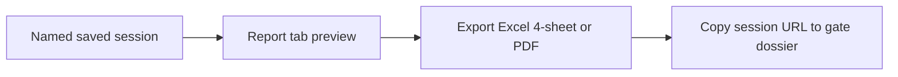

# BOM Comparison — UX Workflow

Proposed user experience for the ArkhitX web replacement of `TPC Database - Synthesis Generator.xlsm`.

**Design principle:** One **Comparison Workspace** — not three Excel pages rebuilt as React tabs.

**Visual system:** ArkhitX design tokens (`ax-*`), dark default, `ThemeToggle` in header. See `framework/docs/DESIGN-SYSTEM.md`.

---

## Why change the UX

The Excel tool (`frmCostbooks`) splits work across three pages with duplicated filters and an export-first output model. Cost engineers and gate reviewers actually need:

1. Find the right costbook quickly among hundreds of vehicle × milestone × date combinations
2. Compare milestones or programs side-by-side
3. Drill from total TPC → system → part → BOM line
4. Explain gaps with evidence for architecture gates
5. Export a snapshot when ready — not as the primary interface

The web app should optimize for **compare → drill → explain → export evidence**.

---

## Shell layout

```text
┌──────────────────────────────────────────────────────────────────────────┐
│  [Logo] Costed BOM Comparison     [Search ⌘K]  [EUR ▼]  [Save] [Export] │
├──────────────┬───────────────────────────────────────────────────────────┤
│              │  Comparison strip (baseline + up to 4 others)           │
│  Carline     ├───────────────────────────────────────────────────────────┤
│  rail        │  KPI row: total TPC · gap vs baseline · currency note   │
│              ├───────────────────────────────────────────────────────────┤
│  · Timeline  │  Chart row: waterfall | 5th split pie | system bars     │
│  · Filters   ├───────────────────────────────────────────────────────────┤
│  · Catalog ▶ │  Detail tabs (context-sensitive default)                │
│              │    Gap Drivers | Systems | Parts | Full BOM | Report    │
├──────────────┴───────────────────────────────────────────────────────────┤
│  Explain panel (collapsible) — Phase 3 chat grounded on selected gaps    │
└──────────────────────────────────────────────────────────────────────────┘
```

| Zone | Role |
|------|------|
| **Header** | Global search, display currency, save session, export snapshot |
| **Carline rail** | Vehicle context — timeline, narrow filters, catalog drawer trigger |
| **Comparison strip** | Active costbooks; first slot = baseline; drag reorder |
| **KPI row** | At-a-glance totals and primary gap |
| **Chart row** | Visual summary; clicks filter detail tabs |
| **Detail tabs** | Tables with linked drill-down |
| **Explain panel** | LLM narration on selected rows (Phase 3); hidden in Phase 0 |

---

## Primary user journeys

### Journey A — Single costbook structure review

*Excel equivalent: frmCostbooks Page 1*


**Default detail tab:** Systems (or Structure overview combining 5th + top systems).

### Journey B — Milestone gap comparison

*Excel equivalent: Page 2 + frmGapExport*


**Default detail tab:** Gap Drivers (two-sided Pareto — increases red, decreases green).

### Journey C — Cross-vehicle comparison

*Excel equivalent: Page 2 with different Vehicle Codes*


### Journey D — Find a costbook in the catalog

*Excel equivalent: Page 3 Data Explorer*


Catalog is a **drawer**, not a separate page — user never leaves the workspace.

### Journey E — Gate evidence package (Phase 1+)

*Ties to Stell AI Arch Gate deliverables*



Session metadata: creator, timestamp, source file URLs, currency, baseline label.

---

## Carline rail

### Vehicle search (header + rail)

- Typeahead on `Vehicle Code`, `commercial_name`, `project`, `program`
- Recent vehicles and saved sessions at top of results
- Selecting a result loads the rail for that carline

### Milestone timeline

Horizontal lifecycle axis using Config milestone order (IM → PM → CM → … → Serial Life), **not alphabetical**.

Each node shows:

- Milestone code
- Milestone date
- Total TPC (in display or source currency)
- Indicator if source file exists in CostBookRecords

**Interactions:**

| Action | Result |
|--------|--------|
| Click | Toggle costbook on comparison strip |
| Shift+click second node | Set baseline + compare (2 selected) |
| Hover | Tooltip: full vehicle label, source filename, refresh date |
| Disabled node | No costbook data for that milestone |

### Narrow filters (rail footer)

Power BI-style multi-select OR filters — carry over from Excel `clsMultiFilter`:

- Region, carline type, platform, powertrain, milestone (when browsing catalog)

Filters narrow **search and catalog**, not the whole app before data appears.

---

## Comparison strip

Replaces: Page 1 costbook combo + Page 2 three combos + frmGapExport five picks.

| Slot | Rule |
|------|------|
| 1 | **Baseline** — badge visible; all gaps measured vs this costbook |
| 2–5 | Compare targets (max 5 total, matching Excel export capability) |
| Empty | Placeholder “Add costbook” opens timeline or ⌘K search |

Each chip shows: `Vehicle · Milestone · Date · Total TPC`.

**Interactions:** drag to reorder (first = baseline), ✕ to remove, click to highlight in charts.

---

## Chart row

Charts are **interactive** — not static PNGs like the Excel form.

| Chart | Single costbook | 2+ costbooks |
|-------|-----------------|--------------|
| **5th split pie** | TPC by Platform / Powertrain / Module / Top Hat / TC&Other | Stacked or grouped by costbook |
| **System bars** | Top N L1 Macro Systems (Pareto) | Waterfall walk baseline → each compare |
| **Gap by 5th** | Hidden | Horizontal bars, split colors per Excel palette |

**5th split colors** (match `modCostbookCharts.SplitColorFor`):

| Label | Color |
|-------|-------|
| Powertrain | `#C0392B` |
| Platform | `#627384` |
| Module | `#1FA187` |
| Top Hat | `#EF7D1A` |
| TC&Other | `#95A5A6` |

**Click behavior:** selecting a slice or bar filters the active detail tab.

---

## Detail tabs

Context-sensitive default when selection changes:

| Selection | Default tab |
|-----------|-------------|
| 1 costbook | Systems |
| 2+ costbooks | Gap Drivers |

### Tab: Gap Drivers

*Excel: Page 2 gap lists + GapReportAgg / AlignedBomGap logic*

- Two-sided Pareto table: increases (red) then decreases (green)
- Columns: label · TPC per costbook · gap · gap % · cumulative gap %
- Toggle **Analysis level:** Macro System · Subsystem · L1 · L2 · L3 · Part Name · 5th
- Row click → Full BOM tab scrolls to aligned lines

### Tab: Systems

*Excel: Page 1 ParetoAgg by macro/L1*

- Pareto table: label · TPC · TPC % · cumulative %
- Green 80/20 band highlight (Excel report parity)
- Row click → Parts tab filtered

### Tab: Parts

*Excel: Top 10 Parts list*

- Top N parts by TPC (configurable N, default 10)
- Part number, description, TPC, cumulative %

### Tab: Full BOM

*Excel: Full BOM sheet + AlignedBomGap*

- Single costbook: all lines, TPC-desc sort, Pareto % columns
- Multi costbook: aligned rows (part number + occurrence index matching)
- Sticky columns: Part Number, Description; scroll for VSC, PORO, Qty, TPC per book

### Tab: Report

*Excel: 4-sheet export layouts — live in browser*

Sub-sections mirroring export workbooks:

**Single costbook (Costbook Report):**

1. Overview — carline attributes, KPIs, embedded charts
2. Full BOM
3. Hierarchical View
4. Hierarchical View by 5th

**Multi costbook (Gap Comparison Report):**

1. Comparison Overview
2. Full BOM Comparison
3. Hierarchical Gaps
4. Hierarchical Gaps by 5th

Export button generates Excel/PDF **snapshot of current Report tab state**.

---

## Header actions

| Control | Behavior |
|---------|----------|
| **Search ⌘K** | Command palette: vehicles, costbooks, recent sessions, actions |
| **Currency ▼** | Display currency or “Source currency”; applies via `CostbookEngine` conversion |
| **Save** | Name + persist ComparisonSession (baseline, compares, filters, currency) |
| **Export** | Excel 4-sheet workbook or PDF; includes provenance footer |

**Provenance footer (always on exports):**

- Source SharePoint URLs per costbook
- Data refresh timestamp
- Display currency and conversion year rule
- Session ID and user

---

## Explain panel (Phase 3)

Collapsible bottom panel; **not** a separate chat product.

| User prompt | System behavior |
|-------------|-----------------|
| “Why did chassis increase?” | Resolve costbooks from strip → `CostbookEngine` gap rows → LLM narrates top drivers |
| “Add CM for this vehicle” | Chat action adds milestone to strip |
| “Summarize for gate deck” | LLM uses Report tab context; numbers from engine only |

Rules: LLM never computes TPC; grounding cites Costbook / PartLine nodes from Neo4j where applicable.

---

## Excel → web mapping

| Excel (`frmCostbooks`) | Web UX |
|------------------------|--------|
| Page 1 Cost Analysis | Single-select workspace mode; Systems / Parts tabs |
| Page 2 Comparative Analysis | 2+ on comparison strip; Gap Drivers default |
| Page 3 Data Explorer | Catalog drawer (⌘K) |
| frmGapExport (5 picks) | Comparison strip slots 1–5 |
| Multi-filter combos | Rail filters + catalog drawer filters |
| Export Costbook Report | Report tab (single) + Export |
| Export Gap Report | Report tab (multi) + Export |
| `ShowCostbooksSynthesis` button | App landing → last session or search |
| Currency combo | Header currency selector |
| Static chart images | Interactive Recharts (or equivalent) |

---

## Route and component map

Suggested structure when scaffolding `projects/bom/frontend/`:

```text
src/
├── App.tsx                          # Routes below
├── pages/
│   ├── WorkspacePage.tsx            # Main shell (single route — no page-per-Excel-tab)
│   └── SessionsPage.tsx             # Optional: list saved comparison sessions
├── components/
│   ├── layout/
│   │   ├── AppHeader.tsx            # Search, currency, save, export, ThemeToggle
│   │   └── ExplainPanel.tsx         # Phase 3 — collapsible chat
│   ├── workspace/
│   │   ├── CarlineRail.tsx          # Search results + timeline + narrow filters
│   │   ├── MilestoneTimeline.tsx
│   │   ├── ComparisonStrip.tsx
│   │   ├── KpiRow.tsx
│   │   └── ChartRow.tsx
│   ├── charts/
│   │   ├── FifthSplitPie.tsx
│   │   ├── SystemParetoBars.tsx
│   │   └── GapWaterfall.tsx
│   ├── detail/
│   │   ├── DetailTabs.tsx           # Tab shell + context-sensitive default
│   │   ├── GapDriversTable.tsx
│   │   ├── SystemsTable.tsx
│   │   ├── PartsTable.tsx
│   │   ├── FullBomTable.tsx
│   │   └── ReportPreview.tsx
│   ├── catalog/
│   │   └── CatalogDrawer.tsx        # Data Explorer replacement
│   └── ui/
│       ├── MultiFilter.tsx          # Port clsMultiFilter behavior
│       ├── CommandPalette.tsx       # ⌘K
│       └── CurrencyBadge.tsx
├── hooks/
│   ├── useComparisonSession.ts
│   ├── useCostbookIndex.ts
│   └── useCostbookEngine.ts         # API calls to deterministic backend
└── lib/
    ├── fifthColors.ts               # Split color palette
    └── milestoneOrder.ts            # Config lifecycle order
```

### Routes

| Path | Page | Notes |
|------|------|-------|
| `/` | Redirect → `/workspace` | |
| `/workspace` | `WorkspacePage` | Default empty state: search prompt |
| `/workspace/:sessionId` | `WorkspacePage` | Restore saved session |
| `/sessions` | `SessionsPage` | Optional gate-review list view |

**Intentionally no** `/cost-analysis`, `/comparative`, `/explorer` routes — one workspace handles all modes.

---

## API endpoints (backend support)

| Endpoint | Serves |
|----------|--------|
| `GET /api/costbooks/search?q=` | Vehicle typeahead |
| `GET /api/carlines/:id/timeline` | Milestone nodes with totals |
| `GET /api/costbooks/index` | Catalog explorer (filtered) |
| `POST /api/comparisons/calculate` | Body: baseline + compares + currency → KPIs, charts data, tab payloads |
| `GET /api/comparisons/sessions` | Saved sessions |
| `POST /api/comparisons/sessions` | Save session |
| `POST /api/reports/export` | Excel/PDF snapshot |

Single **`/calculate`** call returns everything the workspace needs — avoids the Excel pattern of separate preview vs export code paths diverging.

---

## Empty and loading states

| State | UX |
|-------|-----|
| First visit | Centered search: “Find a vehicle program to begin” + recent sessions |
| No costbook for milestone | Timeline node grayed; tooltip explains missing data |
| 1 on strip | Charts show structure; Gap tab disabled with hint |
| Engine loading | Skeleton on KPI + charts; rail stays interactive |
| Mixed source currencies | Banner: “Comparing mixed currencies — select display currency” |

---

## Phase rollout

| Phase | UX deliverable |
|-------|----------------|
| **0** | Workspace shell, timeline, strip, Systems/Parts/Gap/Full BOM tabs, catalog drawer, export |
| **1** | Saved sessions, provenance footer, link to gate dossier |
| **3** | Explain panel, grounded chat actions |
| **4** | Golden-query UX tests (“CM vs IM on vehicle X” always lands on Gap tab with correct totals) |

---

## Parity checklist (UX vs Excel)

- [ ] Milestone order follows lifecycle, not alphabetical
- [ ] Baseline = first comparison strip slot; gap vs baseline explicit
- [ ] Multi-select OR filters behave like Excel `(All)` / multi-value OR
- [ ] 5th split colors match Deneb / Excel palette
- [ ] Gap table: increases first, then decreases; cumulative gap % per side
- [ ] Full BOM alignment: part number, occurrence index, zero when missing
- [ ] Up to 5 costbooks on strip (export parity)
- [ ] Currency chip visible; conversion year rules documented in UI
- [ ] Source file link on every costbook in catalog and report provenance
- [ ] Report tab matches 4-sheet export layouts numerically

---

## Related docs

- [TPC-SYNTHESIS-GENERATOR-OVERVIEW.md](./TPC-SYNTHESIS-GENERATOR-OVERVIEW.md) — business capabilities
- [TPC-SYNTHESIS-GENERATOR-TECHNICAL.md](./TPC-SYNTHESIS-GENERATOR-TECHNICAL.md) — VBA logic to preserve behind the UI
- [ARKHITX-REBUILD-PLAN.md](./ARKHITX-REBUILD-PLAN.md) — build phases and agent wiring
