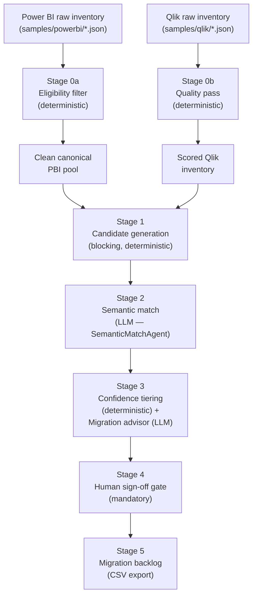
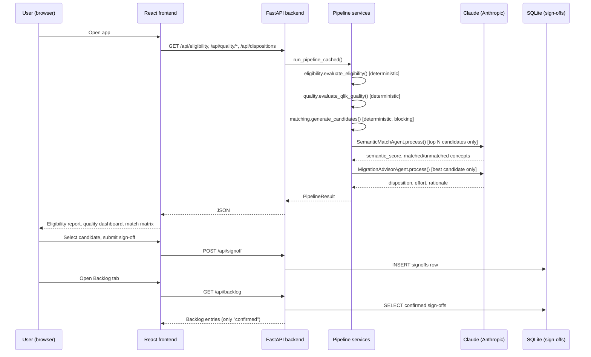

# Qlik to Power BI Migration Assessor — Architecture

## How to view these diagrams

| Method | How |
|--------|-----|
| **Browser (recommended)** | Open [`architecture-overview.html`](./architecture-overview.html) in Chrome/Edge — Mermaid renders automatically |
| **Cursor Markdown preview** | Open this file → `Ctrl+Shift+V` (Windows) or `Cmd+Shift+V` (Mac) |
| **ASCII (always visible)** | Scroll to [ASCII Overview](#ascii-overview) — no preview needed |

---

## ASCII Overview

```
                     ┌────────────────────────┐        ┌────────────────────────┐
                     │ samples/powerbi/*.json  │        │ samples/qlik/*.json     │
                     │ (Scanner API shape)     │        │ (QRS API shape)        │
                     └───────────┬────────────┘        └───────────┬────────────┘
                                 ▼                                  ▼
                     ┌────────────────────────┐        ┌────────────────────────┐
                     │ Stage 0a: Eligibility   │        │ Stage 0b: Quality pass │
                     │ filter (deterministic)  │        │ (deterministic)        │
                     └───────────┬────────────┘        └───────────┬────────────┘
                                 ▼                                  ▼
                     ┌────────────────────────┐        ┌────────────────────────┐
                     │ Clean PBI pool          │        │ Scored Qlik inventory  │
                     └───────────┬────────────┘        └───────────┬────────────┘
                                 └───────────────┬──────────────────┘
                                                  ▼
                                     ┌─────────────────────────┐
                                     │ Stage 1: Candidate gen   │
                                     │ (blocking, deterministic)│
                                     └────────────┬─────────────┘
                                                  ▼
                                     ┌─────────────────────────┐
                                     │ Stage 2: Semantic match   │
                                     │ (LLM, narrowed set only)  │
                                     └────────────┬─────────────┘
                                                  ▼
                                     ┌─────────────────────────┐
                                     │ Stage 3: Confidence tier  │
                                     │ + Migration advisor (LLM) │
                                     └────────────┬─────────────┘
                                                  ▼
                                     ┌─────────────────────────┐
                                     │ Stage 4: Human sign-off   │
                                     │ gate (mandatory)          │
                                     └────────────┬─────────────┘
                                                  ▼
                                     ┌─────────────────────────┐
                                     │ Stage 5: Migration backlog│
                                     └─────────────────────────┘
```

---

## Pipeline Flow (Mermaid)



## Request Flow — Eligibility + Matching (Mermaid)



## Component Responsibilities

| Layer | Component | Responsibility |
|-------|-----------|------------------|
| Data | `samples/qlik/qlik_apps_export.json` | Sample Qlik QRS-shaped export (3 apps) — see `DATA-SCHEMAS.md` |
| Data | `samples/powerbi/powerbi_scan_result.json` | Sample Power BI Scanner API-shaped export (20 apps, 6 workspaces) |
| Backend | `services/ingestion.py` | Parses raw JSON into normalized `QlikApp`/`PowerBIApp` models |
| Backend | `services/eligibility.py` | Stage 0a — deterministic PBI exclusion rules + near-duplicate clustering |
| Backend | `services/quality.py` | Stage 0b — Qlik completeness scoring + cross-platform parity matrix |
| Backend | `services/matching.py` | Stage 1 — candidate blocking + confidence tiering (pluggable interface) |
| Backend | `agents/semantic_match_agent.py` | Stage 2 — LLM business-intent comparison, graceful fallback if LLM unavailable |
| Backend | `agents/migration_advisor_agent.py` | Stage 3 — LLM disposition/effort/rationale, grounded in deterministic facts |
| Backend | `services/signoff.py` + `models/db_models.py` | Stage 4/5 — mandatory human sign-off gate (SQLite), migration backlog builder |
| Backend | `services/pipeline.py` | Orchestrates all stages; caches results (LLM calls are real, real cost) |
| Backend | `api/pipeline.py` | FastAPI routes for every stage |
| Frontend | `pages/HomePage.tsx` + `components/*` | Tabbed workbench: Eligibility Report, Quality Dashboard, Match Matrix + Detail pane + sign-off form, Migration Backlog |

## Phase 0 vs Future Phases (ArkhitX)

| Concern | Phase 0 (now) | Phase 2–3 (ArkhitX) |
|---------|---------------|---------------------|
| Candidate generation at scale | In-memory O(n×m) (fine for 3×20, fine for 400×~2,000 post-filtering) | Neo4j graph traversal — "PBI datasets within 2 hops via a shared data connection" — for the full 400×75,000 estate |
| Grounding storage | None (deterministic facts passed inline to LLM calls) | Neo4j knowledge graph — `MATCHES`, `SHARES_DATA_SOURCE`, `EXCLUDED_BECAUSE`, `SIGNED_OFF_BY` edges |
| Agent prompts | In code (`get_system_prompt()`) | `agent_prompts` table, loaded at runtime |
| Audit trail | None | Every LLM call logged to `audit_logs` via `GovernedBaseAgent` |
| Grounding score | None | Measured per response once agents extend `GovernedBaseAgent` |
| Sign-off persistence | SQLite (app's own DB) | Same table, plus `SIGNED_OFF_BY` edges in the knowledge graph for audit |
